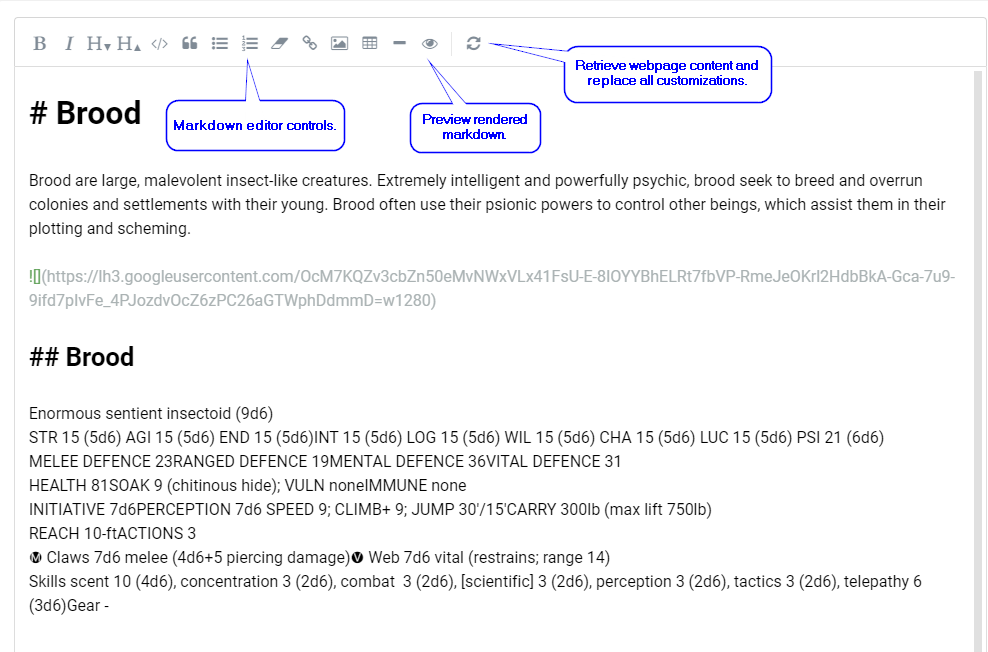
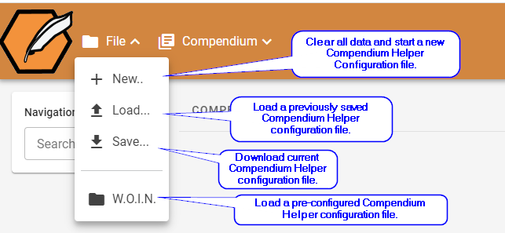
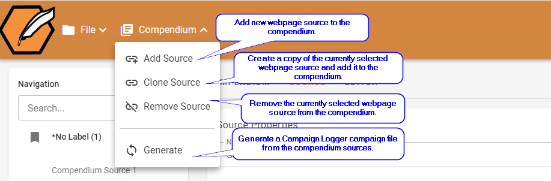
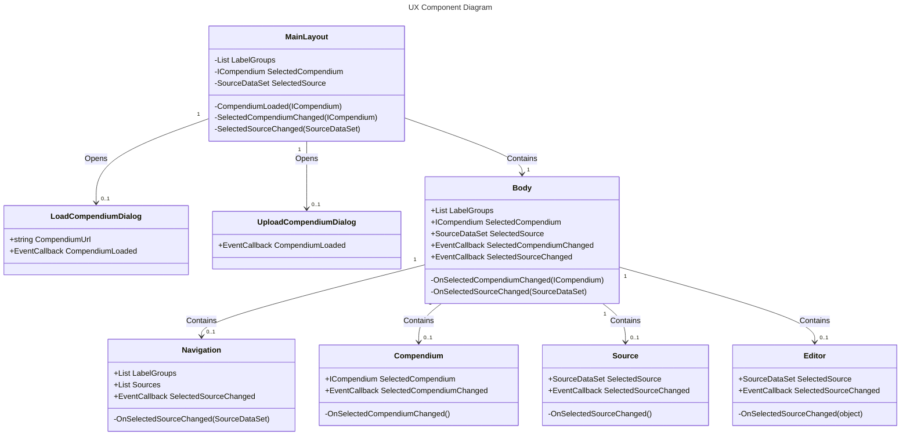

# Compendium Helper

## Description

**Compendium Helper** is a single-page web application designed to assist users in creating
[Campaign Logger](https://app.campaign-logger.com/) campaign files from publicly available
websites.

At is core, **Compendium Helper** is a web scraper; you provide the configuration and 
it will scrape and format the content for import into the Campaign Logger application.

## Getting Started

### Prerequisites
Compendium Helper is a single-page web application that runs in a web browser.  It is
written in C# and uses the [Blazor](https://dotnet.microsoft.com/apps/aspnet/web-apps/blazor)
framework. To run the application you will need to have the [.NET 7.0 SDK](https://dotnet.microsoft.com/download/dotnet/7.0)
installed on your computer.

### Cloning the Repository
To clone the repository, open a command prompt and enter the following command:

```bash
git clone https://github.com/open-campaign-logger/compendium-helper.git
```

### Running the Application
To run the application, open a command prompt and enter the following command:

```bash
dotnet run --project CompendiumHelper
```

Once the application is running, open a web browser and navigate to [http://localhost:5001](http://localhost:5001).

### Loading a Sample Compendium
Sample compendiums can be found at the bottom of the File menu.  Select one of the available sample compendiums to explore the tool's usage.


## Configuration Items

### Compendiums

> **Compendium** = A collection of webpage sources.

A compendium is a collection of webpage sources that are related to a specific topic.  For example,
a compendium could be created for the topic of "Dwarves", and contain all of the dwarves that
are found in the various source materials that you have access to.

Once you've configured a compendium you can:
1. Customize the content that is scraped for each source,
2. Generate a Campaign Logger file from the sources, or
3. Download the Compendium Helper configuration file so that you can share it with others.
 
### Sources

> **Source** = A webpage source that contains content that you want included in a compendium.

Sources represent public webpages that you want included in the compendium.  For example, a source
could be a specific dwarf, such as "Gimli", or it could be a group of dwarves, such as "The
Dwarves of the Lonely Mountain".

### Labels

> **Label** = A meta-data label to used to group sources.

Labels are used to categorize sources. For example, you could create labels called "Mountain",
"Hill" and "Deep" to categorize the various dwarves that are found in your compendium.

Labels are used throughout the Campaign Logger application as meta-data to help you find
content more quickly.

## Configuration

### Compendiums


- ***Name:*** The name of the compendium.
- ***Description:*** A description of the compendium.
- ***Game System:*** The game system that the compendium is for.
- ***Image URL:*** The URL of an image that represents the compendium.

### Source


- ***Name:*** The name of the source.  Must be unique in the compendium.
- ***Lables:*** Comma delimited list of labels that are associated with the source.
- ***Source URI:*** The URI of the source.
- ***Starting XPath:*** The XPath of the element that contains the content that you want to scrape.
- ***Tag Symbol:*** The tag symbol to use when creating the entry for the Campaign Logger file.
- ***Is Public:*** Indicates whether or not the content should be in the GM view (unchecked) or the player view (checked).

### Editor

The editor provides a WYSIWYG interface for editing the content that is scraped from the source.  Customized content is stored in the compendium configuration file.

***Note: After making change to the content, don't forget to click the "Save" button to download your updated configuration file.***

- TODO

### File Menu



### Compendium Menu



## Design



## Dependencies

1. **Microsoft.AspNetCore.Components**
   - **Description**: A collection of packages that provide ASP.NET Core components, allowing developers to build interactive web UIs using C#.
   - **Link**: [ASP.NET Core Components](https://docs.microsoft.com/en-us/aspnet/core/blazor/?view=aspnetcore-5.0)

2. **Microsoft.JSInterop**
   - **Description**: Provides interoperability between JavaScript and Blazor.
   - **Link**: [JavaScript interop in ASP.NET Core](https://docs.microsoft.com/en-us/aspnet/core/blazor/javascript-interop?view=aspnetcore-5.0)

3. **Radzen.Blazor**
   - **Description**: A set of native Blazor components.
   - **Link**: [Radzen Blazor Components](https://blazor.radzen.com/)

4. **Markdig**
   - **Description**: A fast, powerful, and extensible Markdown processor for .NET.
   - **Link**: [Markdig on GitHub](https://github.com/lunet-io/markdig)

5. **ReverseMarkdown**
   - **Description**: Converts HTML to Markdown.
   - **Link**: [ReverseMarkdown on GitHub](https://github.com/mysticmind/reversemarkdown-net)

6. **Newtonsoft.Json**
   - **Description**: A popular high-performance JSON framework for .NET.
   - **Link**: [Json.NET](https://www.newtonsoft.com/json)

7. **StyleCop.Analyzers**
   - **Description**: Uses Roslyn to analyze C# code to ensure it adheres to StyleCop's coding rules.
   - **Link**: [StyleCop.Analyzers on GitHub](https://github.com/DotNetAnalyzers/StyleCopAnalyzers)

8. **Radzen.Blazor**
   - **Description**: A set of native Blazor components.
   - **Link**: [Radzen Blazor Components](https://blazor.radzen.com/)

9. **HtmlAgilityPack**
   - **Description**: A .NET library that parses HTML.
   - **Link**: [HtmlAgilityPack on GitHub](https://html-agility-pack.net/)
